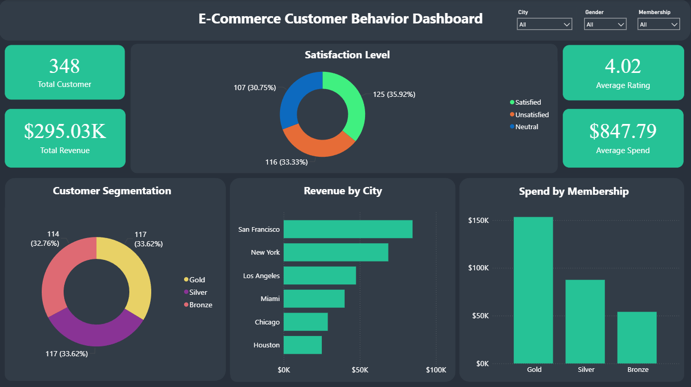

# 🛒 E-Commerce Customer Behavior & Segmentation Analytics
> **An End-to-End Data Analytics Project: Google Spreadsheet ➡️ SQL (BigQuery) ➡️ Python ➡️ Power BI**

---

## 📌 Project Overview
This project performs an in-depth analysis of e-commerce customer shopping patterns, membership loyalty tier performance, satisfaction levels, and behavioral segmentation. 

The primary focus is to transform anomalous, raw datasets into an **Interactive Business Intelligence Dashboard** optimized for customer behavior segmentation, allowing for a deeper understanding of user demographics, engagement tiers, and distinct purchasing traits.

---

## 🛠️ Tools & Technologies
* **Data Preparation & Inspection:** Google Spreadsheet
* **Data Cleaning & ETL Warehouse:** Google BigQuery (SQL)
* **Exploratory Data Analysis (EDA):** Python (`Pandas`, `Matplotlib`, `Seaborn`)
* **Business Intelligence & Data Visualization:** Power BI

---

## 🔄 Project Workflow

[1. Google Spreadsheet] ➡️ [2. BigQuery SQL ETL] ➡️ [3. Python EDA] ➡️ [4. Power BI Interactive Dashboard]

1. **Data Inspection (Google Spreadsheet):** Conducted initial profiling of the raw dataset, identified missing values, and detected structural anomalies.
2. **Data Cleaning & Standardization (SQL):** Implemented a rigorous data-cleaning pipeline in BigQuery, including precise data type casting, string standardization, and invalid transaction exclusion.
3. **Exploratory Data Analysis / EDA (Python):** Uncovered hidden correlations, statistical distributions, and purchasing trends using analytical visualization libraries.
4. **Interactive Dashboard (Power BI):** Developed dynamic, user-friendly visualizations focusing on key business metrics for stakeholder decision-making.

---

## 📊 Dataset Information & Cleaning Action
The dataset captures comprehensive profiles and financial metrics of e-commerce customers.

### Data Dictionary & Cast Transformation:
| Column Name | Data Type (Cleaned) | Cleaning Transformation Applied |
| :--- | :--- | :--- |
| **Customer_ID** | `STRING` | Standardized formatting using `TRIM(CAST())` and filtered out null/empty values. |
| **Gender** | `STRING` | Standardized gender naming conventions and removed spaces via `INITCAP(TRIM())`. |
| **Age** | `STRING` | Cast and cleaned as string format using `TRIM(CAST())`. |
| **City** | `STRING` | Standardized geographical text capitalization and removed leading/trailing spaces via `INITCAP(TRIM())`. |
| **Membership_Type** | `STRING` | Standardized loyalty tier text naming conventions via `INITCAP(TRIM())`. |
| **Total_Spend** | `NUMERIC` | Converted to high-precision numeric type to preserve accurate financial metrics. |
| **Items_Purchased** | `INT64` | Converted to standard 64-bit integer type. |
| **Average_Rating** | `NUMERIC` | Converted to high-precision numeric type for rating metrics. |
| **Discount_Applied** | `BOOL` | Converted to boolean type (`TRUE/FALSE`) for promo tracking. |
| **Days_Since_Last_Purchase** | `INT64` | Converted to standard 64-bit integer type. |
| **Satisfaction_Level** | `STRING` | Standardized sentiment text strings via `INITCAP(TRIM())`. |

> ⚠️ **Key Cleaning Highlight (SQL Data Integrity):**
> During the initial Google Spreadsheet inspection, a specific anomaly was detected: **2 rows were entirely blank/missing** within the `Satisfaction_Level` column. To fix this, advanced data validation was applied using the `NULLIF(TRIM(...), '') IS NOT NULL` structure across all profile columns. This targeted action successfully eliminated those 2 corrupted rows and cleared any ghost formatting before materializing the final dataset (`ecommerce_behavior_final`), ensuring 100% data integrity for the Power BI dashboard.

## 💻 Technical Code Snippets

### 🏢 SQL Data Transformation Pipeline (BigQuery)
Below is the core ETL and standardization script used to clean the raw dataset and materialize the final analytical table:

<details>
<summary>📂 Click to expand SQL Query</summary>

```sql
CREATE OR REPLACE TABLE
`cleaning-ecommerce-behavior.ecommerce_behavior_cleaning.ecommerce_behavior_cleaned`
AS
SELECT
    -- Customer & Demographics (Standardized)
    TRIM(CAST(`Customer ID` AS STRING)) AS Customer_ID,
    INITCAP(TRIM(Gender)) AS Gender,
    TRIM(CAST(Age AS STRING)) AS Age,
    INITCAP(TRIM(City)) AS City,
    
    -- Segmentations & Behaviours
    INITCAP(TRIM(`Membership Type`)) AS Membership_Type,
    CAST(`Total Spend` AS NUMERIC) AS Total_Spend,
    CAST(`Items Purchased` AS INT64) AS Items_Purchased,
    CAST(`Average Rating` AS NUMERIC) AS Average_Rating,
    CAST(`Discount Applied` AS BOOL) AS Discount_Applied,
    CAST(`Days Since Last Purchase` AS INT64) AS Days_Since_Last_Purchase,
    INITCAP(TRIM(`Satisfaction Level`)) AS Satisfaction_Level
FROM
`cleaning-ecommerce-behavior.ecommerce_behavior_cleaning.ecommerce_behavior_raw`
WHERE
    -- Strict Data Quality Filters
    NULLIF(TRIM(CAST(`Customer ID` AS STRING)), '') IS NOT NULL
    AND NULLIF(TRIM(Gender), '') IS NOT NULL
    AND NULLIF(TRIM(CAST(Age AS STRING)), '') IS NOT NULL
    AND NULLIF(TRIM(City), '') IS NOT NULL
    AND NULLIF(TRIM(`Membership Type`), '') IS NOT NULL
    AND `Total Spend` IS NOT NULL
    AND `Items Purchased` IS NOT NULL
    AND `Average Rating` IS NOT NULL
    AND `Discount Applied` IS NOT NULL
    AND `Days Since Last Purchase` IS NOT NULL
    AND NULLIF(TRIM(`Satisfaction Level`), '') IS NOT NULL
```
</details>

## 📊 Power BI DAX Measures

To support accurate dynamic aggregations within the dashboard, the following core explicit DAX measures were formulated:

<details>
<summary>📂 Click to expand DAX Query</summary>

```dax
Card Total Revenue = SUM('E-commerce Customer Behavior_final'[Total_Spend])
Card Total Customer = DISTINCTCOUNT('E-commerce Customer Behavior_final'[Customer_ID])
Card Avg Spend = AVERAGE('E-commerce Customer Behavior_final'[Total_Spend])
Card Avg Rating = AVERAGE('E-commerce Customer Behavior_final'[Average_Rating])
```
</details>

## 🐍 Python EDA — Key Visualizations

To uncover patterns and validate business insights, exploratory data analysis was conducted using `Pandas`, `Matplotlib`, and `Seaborn`. Below are the four most impactful analyses:

<details>
<summary>📂 Click to expand Python EDA Snippets</summary>

### 1. 🏅 Membership Type vs Total Spend
Validates the Gold membership dominance insight by comparing spending distribution across all membership tiers.

```python
plt.figure(figsize=(8,5))

sns.boxplot(
    x='Membership_Type',
    y='Total_Spend',
    data=df
)

plt.title('Membership Type vs Total Spend')
plt.xlabel('Membership Type')
plt.ylabel('Total Spend')

plt.show()
```

---

### 2. 😐 Customer Satisfaction Distribution
Visual proof of the **Satisfaction Paradox** — majority of customers fall under *Unsatisfied* or *Neutral* despite high average ratings.

```python
plt.figure(figsize=(8,5))

sns.countplot(
    x='Satisfaction_Level',
    data=df
)

plt.title('Customer Satisfaction Level')
plt.xlabel('Satisfaction Level')
plt.ylabel('Count')

plt.show()
```

---

### 3. 🌆 Top 10 Cities by Total Spend
Identifies geographic revenue hotspots, confirming San Francisco and New York as the dominant markets.

```python
top_city = df.groupby('City')['Total_Spend'] \
             .sum() \
             .sort_values(ascending=False)

top_city.head(10).plot(
    kind='bar',
    figsize=(10,5)
)

plt.title('Top 10 Cities by Total Spend')
plt.xlabel('City')
plt.ylabel('Total Spend')

plt.show()
```

---

### 4. 🔥 Correlation Heatmap
Reveals weak correlation between `Average_Rating` and `Total_Spend` — the core statistical evidence behind the Satisfaction Paradox finding.

```python
correlation = df[[
    'Age',
    'Total_Spend',
    'Items_Purchased',
    'Average_Rating',
    'Days_Since_Last_Purchase'
]].corr()

plt.figure(figsize=(7,5))

sns.heatmap(
    correlation,
    annot=True,
    cmap='coolwarm'
)

plt.title('Correlation Heatmap')

plt.show()
```

</details>

---

## 💡 Key Business Insights (Data-Driven)
* 🥇 **Membership Dominance:** *Gold Membership* holders completely dominate customer expenditure, contributing the highest share with **$150K+ in total spend**—nearly tripling the revenue generated by Bronze members ($53K).
* 🌆 **Geographical Hotspots:** **San Francisco** and **New York** emerged as the primary geographical hubs, collectively driving the highest transaction volumes, with San Francisco leading near the **$100K** revenue mark.
* 📈 **High-Value Customer Base:** The e-commerce platform possesses a premium customer base, characterized by a substantial **Average Spend of $847.79** per customer, heavily driven by the high-spending traits of upper membership tiers.
* 💬 **The Satisfaction Paradox:** While the platform maintains a strong **4.02 Average Rating**, the actual *Satisfaction Level* reveals a critical retention risk: **64.08% of total customers** are either *Unsatisfied* (33.33%) or *Neutral* (30.75%), indicating that high ratings do not necessarily guarantee customer delight.

---

## 🖥️ Dashboard Preview
Below is the interactive dashboard designed to showcase the customer segmentation insights:



## 🎯 Strategic Recommendations

- **Mitigate Retention Risk** — Deploy post-purchase surveys to isolate friction 
  points behind the Satisfaction Paradox (64.08% Unsatisfied/Neutral).
- **Nurture Silver & Bronze Tiers** — Implement upgrade milestone rewards to reduce 
  over-reliance on Gold members.
- **Hyper-Localized Campaigns** — Double down on SF & NY; audit underperforming 
  inland cities (Houston, Chicago) for logistical or awareness gaps.

## 📚 What I Learned

- High ratings ≠ high satisfaction — reframed how I define customer success metrics
- Importance of `NULLIF()` for catching ghost/empty rows that pass basic null checks
- End-to-end workflow from raw data → SQL ETL → EDA → BI dashboard

## Author
Robby Adriansyah Fadillah
